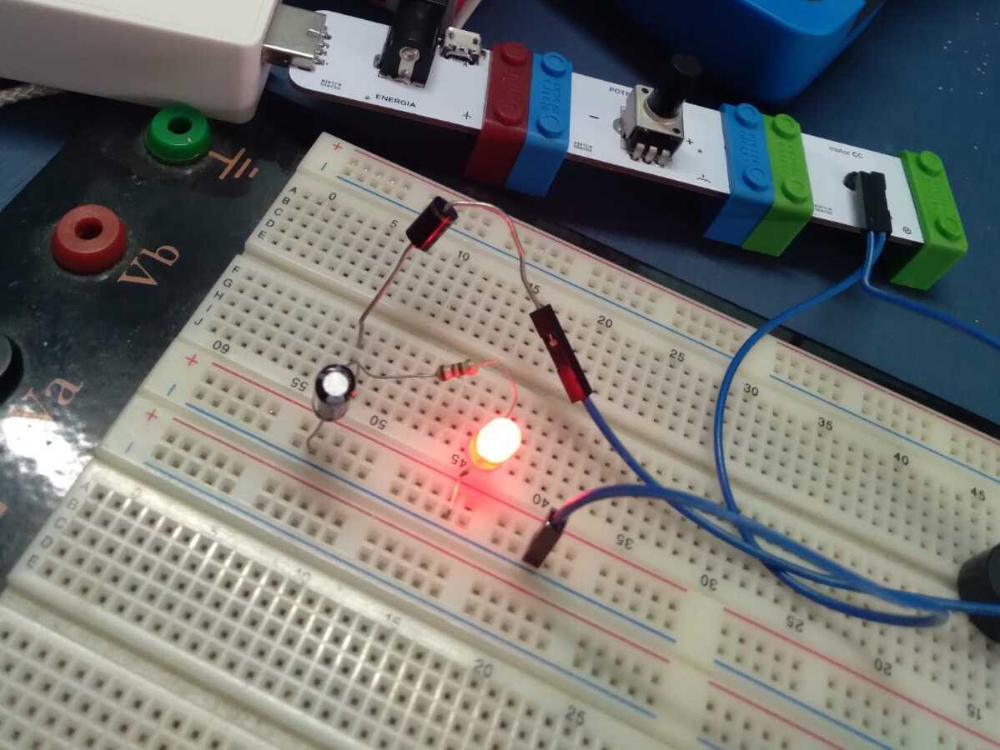
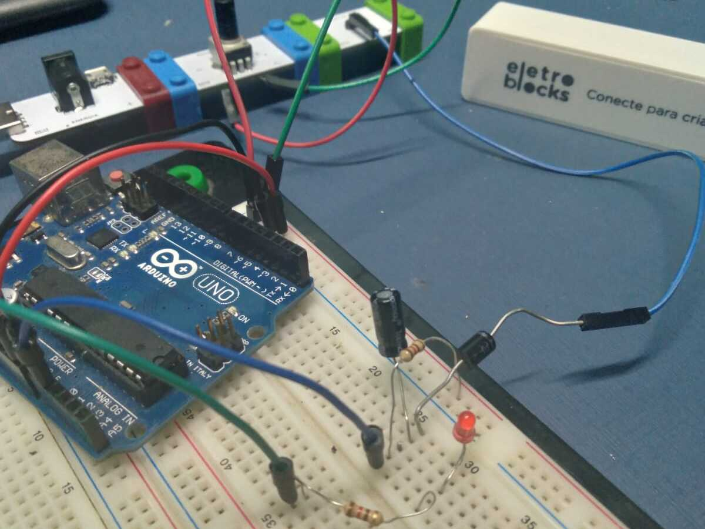

# eletroblock-hacks

| # | Data | Projeto | Clique na imagem para ir |
| :-: | :-: | :- | :-: |
| 1º | 18/09/2021 | Led acende com potenciometro |  |
| 2º | 18/09/2021 | Led intermitente controlado pelo bloco potenciometro utilizando microcontrolador **Arduino UNO**|  | 
