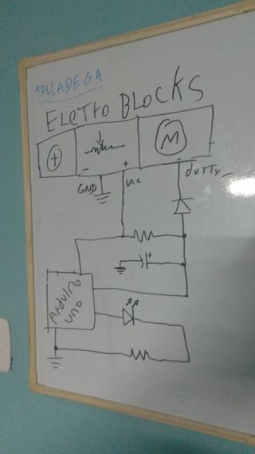
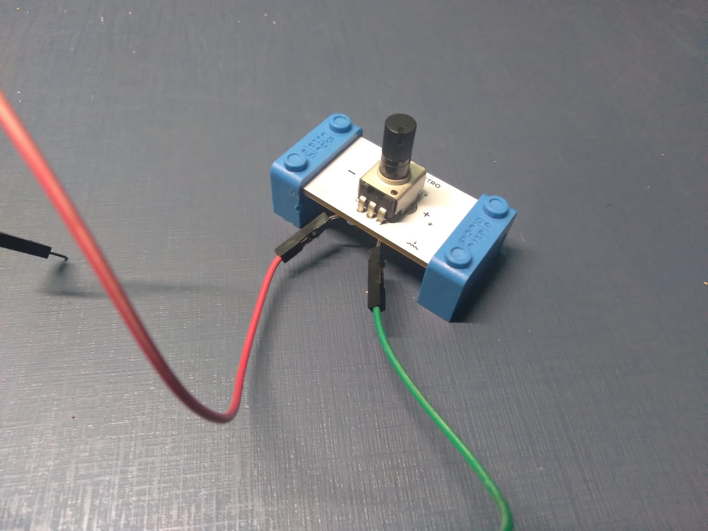
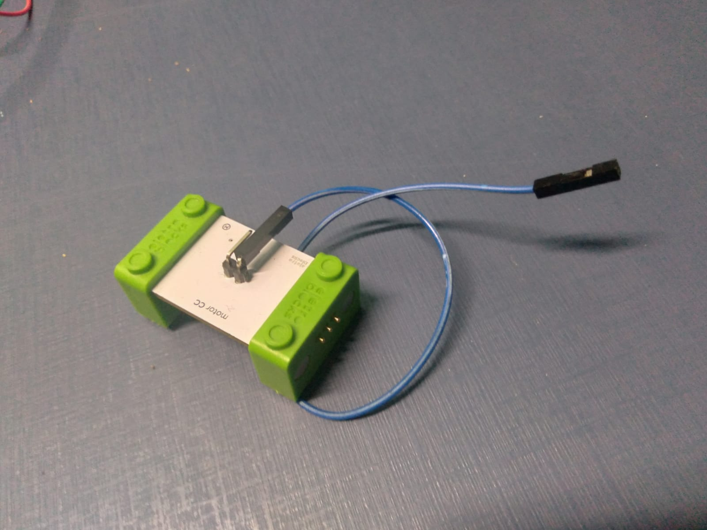

Hack 2
======

Cicuito Eletronico
------------------

| COMPONENTES ELETRONICOS  2x Resistores  1x Capacitor 1x Diodo 1x LED    ELETROBLOCKS  1x Bloco motor 1x Bloco energia 1x Bloco potenciometro _(hackeado)_|  |
| :- | :-: |

Gambiarras
----------

### Gambiarra bloco potenciometro

|  |  |
| :-: | :-: |

* **NOTA** Eu tinha preferencia por fazer o negativo ser verde e vermelho positivo, porém eu não percebi quando quando virei de cabeça para baixo que as cores ficam invertidas, e acabei soldando ao contrário do que gostaria. :laughing:

### Gambiarra bloco motor

|  |
| :-: |

Funcionamento
-------------

https://user-images.githubusercontent.com/29123479/133912041-834976ab-a2d0-4294-8b7a-8af8099f9003.mp4
